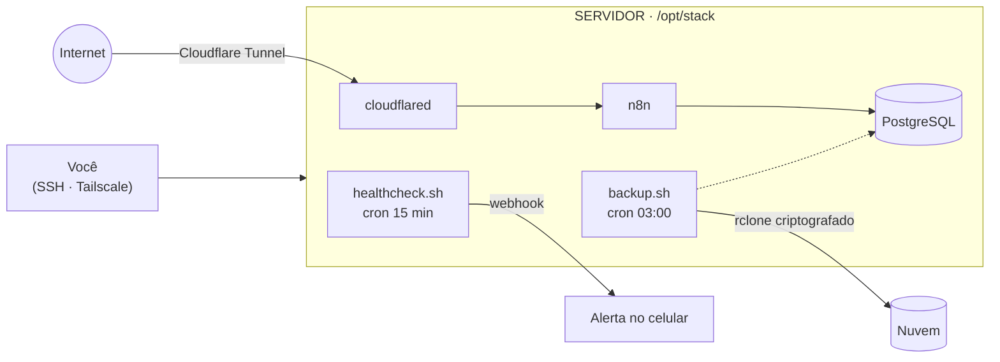

SYSTEM ONLINE // DOCUMENTAÇÃO VIVA

# SERVER//DOCS

Como o servidor foi montado, como mexer nele sem medo, como salvar tudo e como levar para outro hardware — num lugar só, pesquisável e fora do próprio servidor.

&gt; checando hardware ............ <b>OK</b>
&gt; carregando serviços .......... <b>OK</b>
&gt; verificando backups .......... <b>OK</b>
&gt; plano de migração ............ <b>PRONTO</b>

[Começar pela instalação](instalacao/preparacao.md){ .md-button .md-button--primary }
[Ir para o backup](operacao/backup.md){ .md-button }
[Deu problema?](operacao/troubleshooting.md){ .md-button }

## Procurando alguma coisa?

Aperte ++slash++ em qualquer página para abrir a busca. Ou escolha pelo que você quer fazer:

| Eu quero… | Vá para |
|---|---|
| Instalar o servidor do zero | [Preparação](instalacao/preparacao.md) → [Ubuntu Server](instalacao/ubuntu-server.md) → [Pós-instalação](instalacao/pos-instalacao.md) |
| Configurar tudo de uma vez | [Script de bootstrap](instalacao/bootstrap.md) |
| Acessar o servidor de fora de casa | [Rede e acesso remoto](instalacao/rede.md) |
| Subir ou reiniciar um serviço | [Dia a dia com os containers](servicos/gerenciamento.md) |
| Adicionar um serviço novo | [Novo serviço](servicos/novos-servicos.md) |
| Fazer ou restaurar um backup | [Backup e restauração](operacao/backup.md) |
| Saber se está tudo saudável | [Monitoramento](operacao/monitoramento.md) |
| Consertar algo que quebrou | [Troubleshooting](operacao/troubleshooting.md) |
| Mudar para outra máquina | [Migração](migracao/visao-geral.md) |
| Escolher hardware novo | [Hardware de servidor](migracao/hardware.md) |
| Lembrar um comando | [Comandos úteis](referencia/comandos.md) |

## O que tem aqui

-   :material-rocket-launch:{ .lg .middle } **Instalação**

    ---

    Do pendrive ao servidor no ar: BIOS, sistema, segurança, rede e acesso remoto.

    [:octicons-arrow-right-24: Começar](instalacao/preparacao.md)

-   :fontawesome-brands-docker:{ .lg .middle } **Serviços**

    ---

    Docker, a pasta `/opt/stack`, n8n com PostgreSQL e como adicionar novos serviços.

    [:octicons-arrow-right-24: Ver serviços](servicos/docker.md)

-   :material-backup-restore:{ .lg .middle } **Backup e restauração**

    ---

    Scripts prontos, agendamento, envio criptografado para a nuvem e teste de restauração.

    [:octicons-arrow-right-24: Proteger os dados](operacao/backup.md)

-   :material-heart-pulse:{ .lg .middle } **Monitoramento**

    ---

    Healthcheck que avisa no celular quando disco, temperatura ou containers dão problema.

    [:octicons-arrow-right-24: Vigiar o servidor](operacao/monitoramento.md)

-   :material-lifebuoy:{ .lg .middle } **Troubleshooting**

    ---

    "Se X quebrar, faça Y": sintoma, diagnóstico e solução, com os comandos.

    [:octicons-arrow-right-24: Consertar](operacao/troubleshooting.md)

-   :material-truck-fast:{ .lg .middle } **Migração**

    ---

    Levar tudo para outro Lenovo, mini PC, placa de servidor ou VPS — com plano de volta.

    [:octicons-arrow-right-24: Planejar a mudança](migracao/visao-geral.md)

## Arquitetura de referência

!!! info "Ajuste ao seu caso"
    Este é o desenho que a documentação assume (n8n + PostgreSQL atrás de um túnel).
    Se o seu servidor roda outras coisas, troque as caixas e mantenha as regras abaixo.

## As 5 regras de ouro

1. **Tudo em `/opt/stack`.** Um serviço por pasta, com `compose.yaml`, `.env` e `data/`. Copiar essa pasta é migrar o servidor.
2. **Segredos fora do Git.** `.env` fica só no servidor e num gerenciador de senhas.
3. **Acesso que não depende de IP.** Tailscale para você, Cloudflare Tunnel para o público. Trocar de máquina não muda nada para quem usa.
4. **Backup só vale se foi restaurado.** Teste a restauração, não só a cópia.
5. **Mexeu? Anote.** Uma linha no [changelog](referencia/changelog.md) salva você daqui a seis meses.

!!! warning "Este site é público"
    No GitHub Pages grátis, qualquer pessoa lê esta documentação. Aqui entram **comandos,
    estrutura e procedimentos** — nunca senhas, tokens, chaves SSH, conteúdo de `.env`,
    IP público ou domínios que você não queira expor. Veja [Publicar no GitHub Pages](publicar.md).
